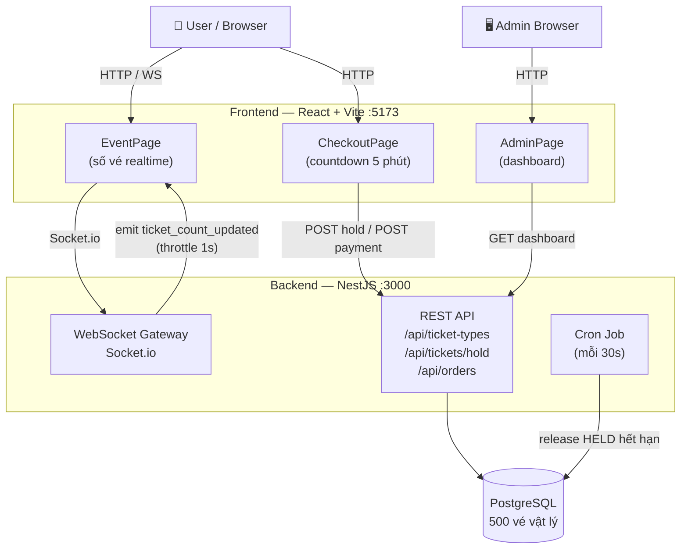

# Mini TicketBox — Hệ thống đặt vé Concert
**Họ và tên:** Lê Quốc Đạt  


## 🏗️ Kiến trúc



**Tech Stack:** NestJS + TypeScript · React + Vite · PostgreSQL · Socket.io · Docker Compose

---

## 🚀 Chạy dự án

### Docker (khuyến nghị)

```bash
cp .env.example .env
./start-dev.sh
```

| Service     | URL                         |
|-------------|-----------------------------|
| Frontend    | http://localhost:5173       |
| Admin       | http://localhost:5173/admin |
| Backend API | http://localhost:3000       |

> Lần đầu chạy: tự động build image, migrate DB và seed 500 vé.

### Chạy thủ công (Node.js v18+, PostgreSQL v14+)

```bash
# Backend
cd backend && npm install && npm run db:migrate && npm run db:seed && npm run start:dev

# Frontend (terminal mới)
cd frontend && npm install && npm run dev
```


## ⚙️ Giải pháp kỹ thuật

### 1. Chống Over-selling — PostgreSQL `FOR UPDATE SKIP LOCKED`

Thay vì dùng counter (`sold_quantity++`), hệ thống pre-generate **500 row vé vật lý** trong DB. Khi user bấm "Chọn vé", 1 câu `UPDATE` atomic xử lý toàn bộ:

```sql
UPDATE tickets SET status = 'HELD', user_id = $1, hold_expires_at = NOW() + INTERVAL '5 minutes'
WHERE id = (
  SELECT id FROM tickets
  WHERE ticket_type_id = $2
    AND (status = 'AVAILABLE' OR (status = 'HELD' AND hold_expires_at < NOW()))
  LIMIT 1
  FOR UPDATE SKIP LOCKED  -- ← mỗi row chỉ bị lock bởi 1 transaction
)
RETURNING id, hold_expires_at;
```

`SKIP LOCKED` đảm bảo 5.000 request song song đều chọn row khác nhau — **không deadlock, không over-sell**.  
Vé HELD hết hạn được cron job tự thu hồi mỗi 30 giây.

> **Tại sao không dùng Redis?** Redis + BullMQ tăng complexity (sync state 2 hệ thống) và không cần thiết ở scale 5.000 user / 500 vé — PostgreSQL xử lý tốt.

### 2. Frontend UX dưới tải cao

- **Button disable ngay khi bấm** — chặn double-submit trước khi server phản hồi.
- **Countdown đồng bộ server** — tính `expires_at - Date.now()` thay vì chạy timer 5:00 thuần client (tránh lệch khi tab treo).
- **WebSocket làm nguồn sự thật duy nhất (client)** — số vé được fetch 1 lần lúc mount, sau đó cập nhật hoàn toàn qua WS event `ticket_count_updated:{id}`. Không polling — tránh tăng tải server khi có 5.000 user online.
- **WS Disconnect UX** — nếu mất kết nối WebSocket quá 10 giây: hiển thị banner cảnh báo `"Mất kết nối thời gian thực"`, disable nút đặt vé (chặn spam click khi data có thể cũ). Khi WS reconnect: ẩn banner, refetch count ngay lập tức, cho phép đặt vé trở lại.
- **Admin polling 10s** — Admin dashboard dùng HTTP polling mỗi 10 giây (thay vì WS). Lý do: admin chỉ 1–2 người → 12 req/phút, hoàn toàn không đáng kể. Quyết định có chủ đích: không phải "xóa polling hết cho sạch" mà là áp dụng đúng chiến lược cho từng đối tượng user.
- **WebSocket throttle 1s** — server giới hạn emit tối đa 1 lần/giây, tránh flood client khi có hàng nghìn giao dịch/giây.

### 3. Clean Code

- **NestJS Module Structure** — tách rõ `controller / service / repository` theo domain (`tickets`, `orders`, `admin`).
- **Global ExceptionFilter** — mọi lỗi trả cùng 1 format: `{ statusCode, error, message, timestamp, path }`.
- **ValidationPipe + class-validator** — validate và sanitize input ở cửa ngõ API.
- **Idempotency** — payment API kiểm tra đơn hàng cũ trước khi xử lý, tránh charge kép khi client retry.
- **Unit Test:** Jest — kiểm tra race condition với 600 concurrent requests, đảm bảo chính xác 200 VIP được hold, 400 còn lại nhận `SOLD_OUT`.

---

## 🧪 Kiểm thử

### Unit Test (tích hợp với DB thực)

```bash
# Yêu cầu: Docker đang chạy (cần kết nối DB)
cd backend && npm test
```

Test case nổi bật: `tickets.service.spec.ts` — gửi 600 concurrent `holdTicket()`, xác minh đúng 200 VIP được giữ, 400 request còn lại throw `ConflictException(SOLD_OUT)`, không có ticketId trùng lặp.

### Load Test (k6 · 5.000 VUs)

```bash
# Yêu cầu: Docker đang chạy + k6 đã cài (https://k6.io/docs/get-started/installation/)
./test-performance.sh
```

Script tự động: khởi chạy k6, sau đó query DB xác minh `SOLD + HELD = 500`.

---

## 📊 Kết quả Load Test (k6 · 5.000 VUs đồng thời)

| Chỉ số | Kết quả |
|--------|---------|
| Vé SOLD | 253 |
| Vé HELD (chưa thanh toán) | 247 |
| **SOLD + HELD = tổng kho** | ✅ **253 + 247 = 500** — không bán lố |
| Data consistency (`sold_tickets = paid_orders`) | ✅ 253 = 253 |
| Over-sell / race condition | ✅ 0 |
| Avg response time | 8.05s _(Docker local, tải cực cao — expected)_ |

> **Kết quả cốt lõi:** `SOLD + HELD = 500` bằng đúng số vé trong kho, chứng minh `SKIP LOCKED` hoàn toàn chặn được race condition. Mỗi vé SOLD đều có order PAID tương ứng — dữ liệu nhất quán tuyệt đối.
