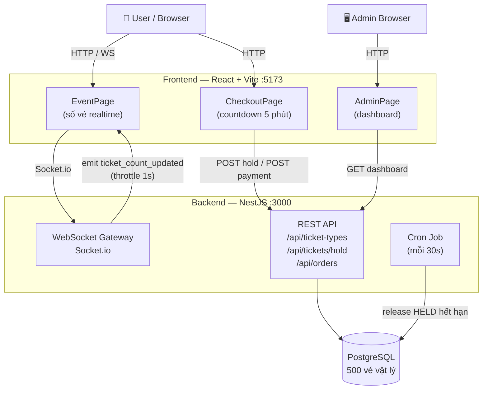

# Mini TicketBox — Hệ thống đặt vé Concert
**Họ và tên:** Lê Quốc Đạt  


## 🏗️ Kiến trúc



**Tech Stack:** NestJS + TypeScript · React + Vite · PostgreSQL · Socket.io · Docker Compose

---

## 🚀 Chạy dự án

### Docker (khuyến nghị)

```bash
# 1. Khởi tạo cấu hình biến môi trường
cp .env.example .env

# 2. Khởi chạy dự án
# Dành cho Linux/macOS (Cần cấp quyền thực thi lần đầu):
chmod +x start-dev.sh
./start-dev.sh

# Hoặc chạy lệnh trực tiếp bằng Docker Compose (Mọi hệ điều hành bao gồm Windows):
docker compose -p nam-viet --env-file .env -f docker/docker-compose.yml -f docker/docker-compose.override.yml up -d
```

| Service     | URL                         |
|-------------|-----------------------------|
| Frontend    | http://localhost:5173       |
| Admin       | http://localhost:5173       |
| Backend API | http://localhost:3000       |

> Lần đầu chạy: tự động build image, migrate DB và seed 500 vé.

### Chạy thủ công (Node.js v18+, PostgreSQL v14+)

```bash
# Backend
cd backend && npm install && npm run start:dev

# Frontend (terminal mới)
cd frontend && npm install && npm run dev
```


## ⚙️ Giải pháp kỹ thuật

### 1. Giải pháp ngăn chặn bán lố vé (Over-selling) bằng PostgreSQL

Thay vì dùng biến đếm (dễ xung đột khi nhiều người mua cùng lúc), hệ thống tạo sẵn **500 vé vật lý** trong DB. Khi đặt vé, hệ thống tìm và giữ đúng 1 vé trống qua một câu lệnh `UPDATE` duy nhất:

```sql
UPDATE tickets SET status = 'HELD', user_id = $1, hold_expires_at = NOW() + INTERVAL '5 minutes'
WHERE id = (
  SELECT id FROM tickets
  WHERE ticket_type_id = $2
    AND (status = 'AVAILABLE' OR (status = 'HELD' AND hold_expires_at < NOW()))
  LIMIT 1
  FOR UPDATE SKIP LOCKED  -- ← mỗi row chỉ bị lock bởi 1 transaction
)
RETURNING id, hold_expires_at;
```

Cú pháp `SKIP LOCKED` giúp hàng nghìn request mua vé đồng thời tự động bỏ qua các hàng đang bị khóa để chọn hàng trống tiếp theo — tránh nghẽn (deadlock) và bán lố (over-sell).  
Vé giữ quá 5 phút không thanh toán sẽ được giải phóng tự động sau mỗi 30 giây.

> **Tại sao không dùng Redis?** Redis + BullMQ tăng complexity (sync state 2 hệ thống) và không cần thiết ở scale 5.000 user / 500 vé — PostgreSQL xử lý tốt.

### 2. Frontend UX dưới tải cao

- **Button disable ngay khi bấm** — chặn double-submit trước khi server phản hồi.
- **Countdown đồng bộ server** — tính `expires_at - Date.now()` thay vì chạy timer 5:00 thuần client (tránh lệch khi tab treo).
- **WebSocket làm nguồn sự thật duy nhất (client)** — số vé được fetch 1 lần lúc mount, sau đó cập nhật hoàn toàn qua WS event `ticket_count_updated:{id}`. Không polling — tránh tăng tải server khi có 5.000 user online.
- **WS Disconnect UX** — nếu mất kết nối WebSocket quá 10 giây: hiển thị banner cảnh báo `"Mất kết nối thời gian thực"`, disable nút đặt vé (chặn spam click khi data có thể cũ). Khi WS reconnect: ẩn banner, refetch count ngay lập tức, cho phép đặt vé trở lại.
- **Admin polling 10s** — Admin dashboard dùng HTTP polling mỗi 10 giây (thay vì WS). Lý do: admin chỉ 1–2 người → 12 req/phút, hoàn toàn không đáng kể. Quyết định có chủ đích: không phải "xóa polling hết cho sạch" mà là áp dụng đúng chiến lược cho từng đối tượng user.
- **WebSocket throttle 1s** — server giới hạn emit tối đa 1 lần/giây, tránh flood client khi có hàng nghìn giao dịch/giây.

### 3. Clean Code

- **NestJS Module Structure** — tách rõ `controller / service / repository` theo domain (`tickets`, `orders`, `admin`).
- **Global ExceptionFilter** — mọi lỗi trả cùng 1 format: `{ statusCode, error, message, timestamp, path }`.
- **ValidationPipe + class-validator** — validate và sanitize input ở cửa ngõ API.
- **Idempotency** — payment API kiểm tra đơn hàng cũ trước khi xử lý, tránh charge kép khi client retry.
- **Unit Test:** Jest — kiểm tra race condition với 600 concurrent requests, đảm bảo chính xác 200 VIP được hold, 400 còn lại nhận `SOLD_OUT`.

### 4. Các trường hợp góc đã xử lý (Edge Cases)

| Tình huống (Edge Case) | Cách giải quyết trong hệ thống |
| :--- | :--- |
| **Spam nút đặt vé / mua vé** | Vô hiệu hóa (disable) nút lập tức ở Frontend khi click để chặn double-submit. |
| **Mua trùng / click đúp thanh toán** | **Idempotency**: Trả về đơn hàng `PAID` cũ nếu đã hoàn tất; dùng khóa `FOR UPDATE` trong giao dịch thanh toán để chặn các yêu cầu song song. |
| **Hết hạn giữ vé (5 phút)** | Hệ thống tự động thu hồi vé quá hạn sau mỗi 30 giây bằng Cron Job. |
| **Lệch giờ countdown** | Tính toán thời gian đếm ngược dựa trên hiệu số với giờ server (`expires_at - Date.now()`) thay vì dùng timer client thuần túy. |
| **Mất mạng khi đang giao dịch** | Nếu mất kết nối WebSocket > 10s: Hiển thị cảnh báo, khóa mua vé và kích hoạt dự phòng **HTTP Polling** mỗi 5s để cập nhật số lượng. |
| **Tràn màn hình khi có hàng nghìn giao dịch** | Giới hạn tần suất gửi tin nhắn WebSocket từ server tối đa 1 lần/giây. |
| **Mất kết nối DB tạm thời** | Cơ chế tự động kết nối lại 5 lần (cách nhau 2s) khi khởi chạy Backend. |

---

## 🧪 Kiểm thử

### Unit Test (tích hợp với DB thực)

Yêu cầu các container Docker phải đang chạy. Có 2 cách chạy bộ test tích hợp:

**Cách 1: Chạy bên trong Docker Container (khuyến nghị)**
```bash
docker exec -it ticketbox-backend npm test
```

**Cách 2: Chạy trực tiếp trên Host machine**
Do PostgreSQL trong Docker map cổng `5433:5432`, khi chạy test từ Host cần truyền các biến môi trường ghi đè:
```bash
cd backend
DATABASE_HOST=localhost DATABASE_PORT=5433 npm test
```


Test case nổi bật: `tickets.service.spec.ts` — gửi 600 concurrent `holdTicket()`, xác minh đúng 200 VIP được giữ, 400 request còn lại throw `ConflictException(SOLD_OUT)`, không có ticketId trùng lặp.

### Load Test (k6 · 5.000 VUs)

```bash
# Cấp quyền thực thi và chạy script (Linux/macOS):
chmod +x test-performance.sh
./test-performance.sh

# Hoặc chạy trực tiếp qua k6 Docker trên mọi hệ điều hành (không cần cài k6 trên máy):
docker run --rm -i --network=host -v "$(pwd)/backend/test/load:/app" -w /app grafana/k6 run loadtest.js
```
*Lưu ý: Script `./test-performance.sh` sẽ tự động kiểm tra k6 trên máy bạn; nếu chưa cài k6, script sẽ tự động chuyển sang chạy thông qua Docker container `grafana/k6`.*

Script tự động: khởi chạy k6, sau đó query DB xác minh `SOLD + HELD = 500`.

---

## 📊 Kết quả Load Test (k6 · 5.000 VUs đồng thời)

| Chỉ số | Kết quả |
|--------|---------|
| Vé SOLD | 253 |
| Vé HELD (chưa thanh toán) | 247 |
| **SOLD + HELD = tổng kho** | ✅ **253 + 247 = 500** — không bán lố |
| Data consistency (`sold_tickets = paid_orders`) | ✅ 253 = 253 |
| Over-sell / race condition | ✅ 0 |
| Avg response time | 8.05s _(Docker local, tải cực cao — expected)_ |

> **Kết quả cốt lõi:** `SOLD + HELD = 500` bằng đúng số vé trong kho, chứng minh `SKIP LOCKED` hoàn toàn chặn được race condition. Mỗi vé SOLD đều có order PAID tương ứng — dữ liệu nhất quán tuyệt đối.
